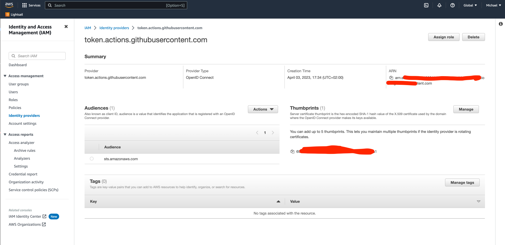
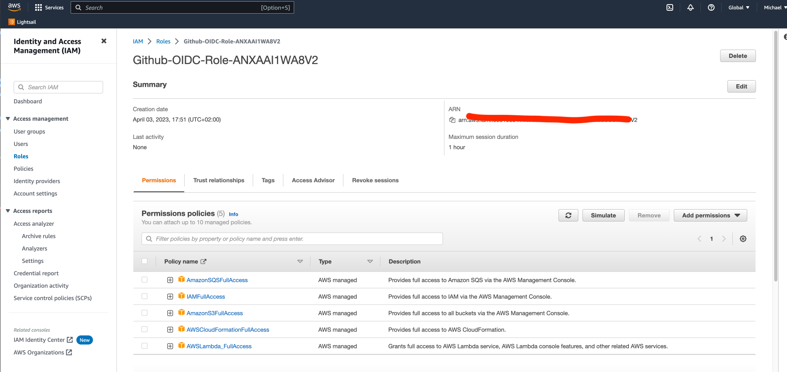

# Configuring OpenID Connect in Amazon Web Services

## Overview

OpenID Connect (OIDC) is the recommended way to authenticate the Github Action user in AWS and allows your GitHub Actions workflows to access resources in Amazon Web Services (AWS), without needing to store the AWS credentials as long-lived GitHub secrets.

This document summarizes these guides:

- [Configuring OpenID Connect in Amazon Web Services](https://docs.github.com/en/actions/deployment/security-hardening-your-deployments/configuring-openid-connect-in-amazon-web-services)
- [https://github.com/aws-actions/configure-aws-credentials#usage](https://github.com/aws-actions/configure-aws-credentials#usage)

## 1. Create new Identity Provider in AWS

- Go the AWS console and create a new Identity Provider in IAM.



## 2. Create a new CloudFormation stack

Go to the AWS CloudFormation console and create a new stack using the template from the [aws-actions/configure-aws-credentials](https://github.com/aws-actions/configure-aws-credentials#sample-iam-oidc-cloudformation-template) repository.

> Make sure to replace the placeholder with your github user name, the repo name and the AWS ARN from the previous step.

```yaml
Parameters:
  GitHubOrg:
    Description: Name of GitHub organization/user (case sensitive)
    Type: String
  RepositoryName:
    Description: Name of GitHub repository (case sensitive)
    Type: String
  OIDCProviderArn:
    Description: Arn for the GitHub OIDC Provider.
    Default: ''
    Type: String
  OIDCAudience:
    Description: Audience supplied to configure-aws-credentials.
    Default: 'sts.amazonaws.com'
    Type: String

Conditions:
  CreateOIDCProvider: !Equals
    - !Ref OIDCProviderArn
    - ''

Resources:
  Role:
    Type: AWS::IAM::Role
    Properties:
      AssumeRolePolicyDocument:
        Statement:
          - Effect: Allow
            Action: sts:AssumeRoleWithWebIdentity
            Principal:
              Federated: !If
                - CreateOIDCProvider
                - !Ref GithubOidc
                - !Ref OIDCProviderArn
            Condition:
              StringEquals:
                token.actions.githubusercontent.com:aud: !Ref OIDCAudience
              StringLike:
                token.actions.githubusercontent.com:sub: !Sub repo:${GitHubOrg}/${RepositoryName}:*

  GithubOidc:
    Type: AWS::IAM::OIDCProvider
    Condition: CreateOIDCProvider
    Properties:
      Url: https://token.actions.githubusercontent.com
      ClientIdList:
        - sts.amazonaws.com
      ThumbprintList:
        - 6938fd4d98bab03faadb97b34396831e3780aea1

Outputs:
  Role:
    Value: !GetAtt Role.Arn
```

## 3. Update Role Permissions

Go to IAM Roles and find the newly created role. Add the following permissions to the role:

- `AmazonSQSFullAccess`
- `AWSLambdaFullAccess`
- `AmazonS3_FullAccess`
- `AWSCloudFormationFullAccess`
- `IAMFullAccess`



## 4. Update the Github Actions workflow

Copy the AWS ARN from the previous step and update `OIDC_ROLE` in the to the `.github/workflows/deploy-feature.yaml` file
